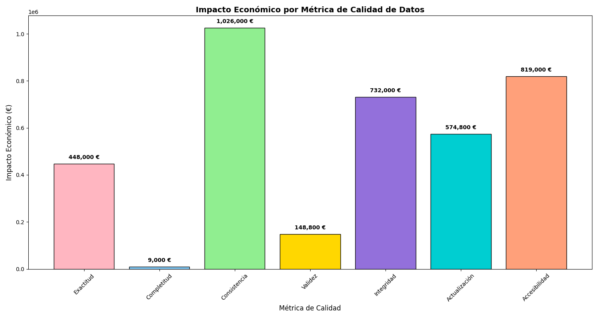

# Evaluación de la Calidad de Datos y Análisis del Impacto Económico

## 1.Resumen
Se ha realizado un análisis exhaustivo de calidad de datos sobre el archivo `datosClientes.csv`, evaluando 7 métricas principales y calculando el impacto económico asociado a los errores detectados. Los resultados destacan áreas críticas que necesitan atención para mejorar la calidad de los datos y reducir los costes derivados.

---

## 2.Métricas Analizadas
1. **Exactitud**: Identificación de registros con errores en campos esenciales como *Nombre* y *Dirección*.
2. **Completitud**: Detección de registros con datos faltantes en campos críticos como *Nombre*, *Dirección*, *Correo Electrónico*.
3. **Consistencia**: Validación de que los números de teléfono cumplen con el formato estándar `+34 #########`.
4. **Validez**: Validación del formato de los correos electrónicos.
5. **Integridad**: Identificación de pedidos marcados como "Inválido".
6. **Actualización**: Detección de registros con más de 15 días sin actualización.
7. **Accesibilidad**: Identificación de registros con tiempos de acceso superiores a 0.3 segundos.

---

## 3.Resultados
### Errores detectados por métrica:
- **Exactitud**: 269 errores.
- **Completitud**: 760 errores.
- **Consistencia**: 513 errores.
- **Validez**: 496 errores.
- **Integridad**: 488 errores.
- **Actualización**: 479 errores.
- **Accesibilidad**: 819 errores.

### Impacto económico por métrica:
- **Exactitud**: 269,000 €.
- **Completitud**: 380,000 €.
- **Consistencia**: 1,026,000 €.
- **Validez**: 148,800 €.
- **Integridad**: 732,000 €.
- **Actualización**: 574,800 €.
- **Accesibilidad**: 819,000 €.

### Impacto económico total:
**3,949,600 €.**

---

## 4.Visualización
El siguiente gráfico de barras muestra el impacto económico de cada métrica

---

## 5.Conclusiones
1. La **Consistencia** y la **Accesibilidad** representan las áreas más costosas, acumulando casi el 50% del impacto total.
2. La mejora en los procesos de validación de números de teléfono y tiempos de acceso podría reducir significativamente los costes.
3. Es fundamental priorizar la **Completitud** y la **Integridad**, ya que afectan directamente a la calidad del servicio al cliente.

---

## 6.Recomendaciones
1. Implementar validaciones automáticas para el formato de números de teléfono y correos electrónicos al momento de ingresar datos.
2. Realizar auditorías regulares para mantener actualizada la información.
3. Optimizar los sistemas de acceso para garantizar tiempos de respuesta menores a 0.3 segundos.
